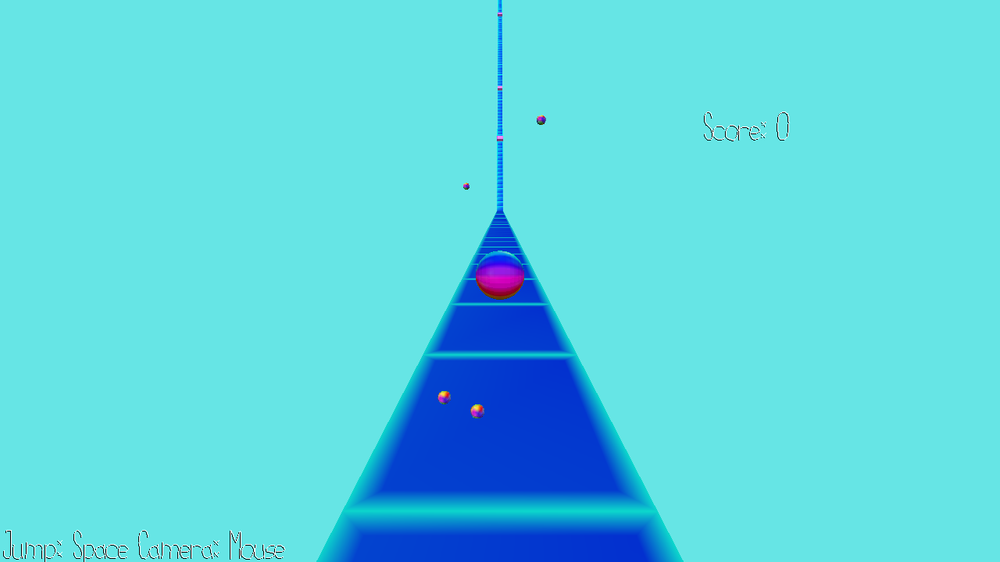

# Rhythm Parkour

Author: Jiasheng Zhou \<jiashen2@andrew.cmu.edu\>

Design: In this game, you control a ball to jump over obstacles with the rhythm of the background music. Get as many score as possible by jump with the beats!

Screen Shot:

How To Play:

Control:\
Space: Jump\
Mouse: Camera Movement

Sources:

This game was built with [NEST](NEST.md).

